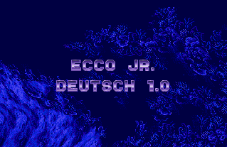

# Ecco Jr. Translation Project

This fan projects provides a German translation for [Ecco Jr.](https://en.wikipedia.org/wiki/Ecco_Jr.) for the SEGA Mega Drive.

## Info about translation

* Has to have same number of newlines as original string
* Has to have same length as original string

## How to Build

1. Use `make patch` to create the patch
2. This will download dependencies and will do the actual patching:
   1. `write.py` writes language tables to a file. We defined the offset of the ASCII encoded text from the original game.
   2. `enrich.py` takes the content from `strings_de.txt` and enriches it into the language table at `texts.json`
   3. `write.py` reads the content from the enriched language table and writes it back to rom at the given offsets
3. An IPS patch will be created

## Rights

This fan project is not connected to SEGA. All rights belong to their respective owners.
